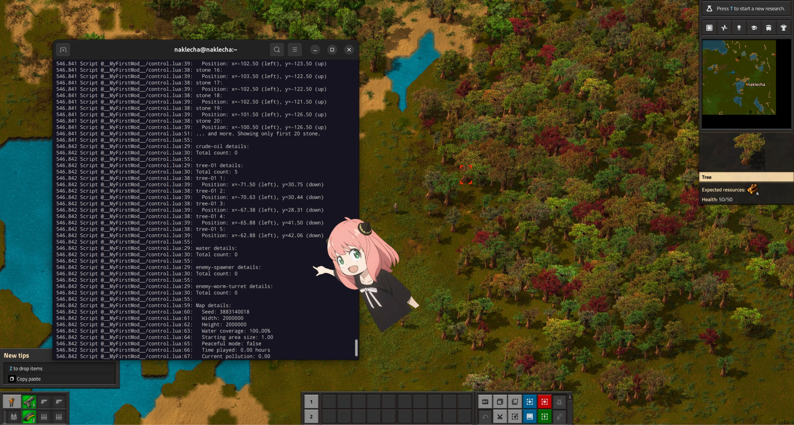

# factorio-automation
<i>this repository is work in progress...</i>

```factorio-automation``` is a powerful library that provides a set of remote interfaces that can be used to create Factorio agents. This library allows users to control player actions, manage resources, and automate complex processes through simple function calls.

<div>
    
</div>

## Remote Interfaces

```walk_to_entity(entity_type, entity_name, search_radius)```

Instructs the player to walk to the nearest entity of the specified type and name within the given search radius.

```mine_entity(entity_type, entity_name)```
Commands the player to mine the nearest entity of the specified type and name.

```place_entity(entity_name)```
Places an entity of the specified name at the given position.

```place_item_in_chest(item_name, count)```
Instructs the player to place the specified number of items into a nearby chest.

```auto_insert_nearby(item_name, entity_type, max_count)```
Automatically inserts items into nearby entities of the specified type, up to the maximum count.

```pick_up_item(item_name, count, container_type)```
Commands the player to pick up a specified number of items from nearby containers of the given type.

```craft_item(item_name, count)```
Instructs the player to craft a specified number of items.

```attack_nearest_enemy(search_radius)```
Commands the player to attack the nearest enemy within the given search radius.

```research_technology(technology_name)```
Initiates research for the specified technology.

```log_player_info(player_id)```
Logs detailed information about the player, including inventory, equipment, and surrounding entities.

## Usage Examples

### Walking to an Entity
```lua
remote.call("factorio_tasks", "walk_to_entity", "resource", "iron-ore", 50)
```
This command will make the player walk to the nearest iron ore patch within a 50-tile radius.

### Mining an Entity
```lua
remote.call("factorio_tasks", "mine_entity", "resource", "copper-ore")
```
This will instruct the player to mine the nearest copper ore.
### Placing an Entity
```lua
remote.call("factorio_tasks", "place_entity", "assembling-machine-1")
```
This command places an assembling machine at coordinates (10, 10).

### Crafting Items
```lua
remote.call("factorio_tasks", "craft_item", "electronic-circuit", 50)
```
This instructs the player to craft 50 electronic circuits.

### Researching Technology
```lua
remote.call("factorio_tasks", "research_technology", "automation")
```
This initiates research for the "automation" technology.

### Contributing
Contributions to Automate Factorio are welcome! Please feel free to submit pull requests, create issues or spread the word.